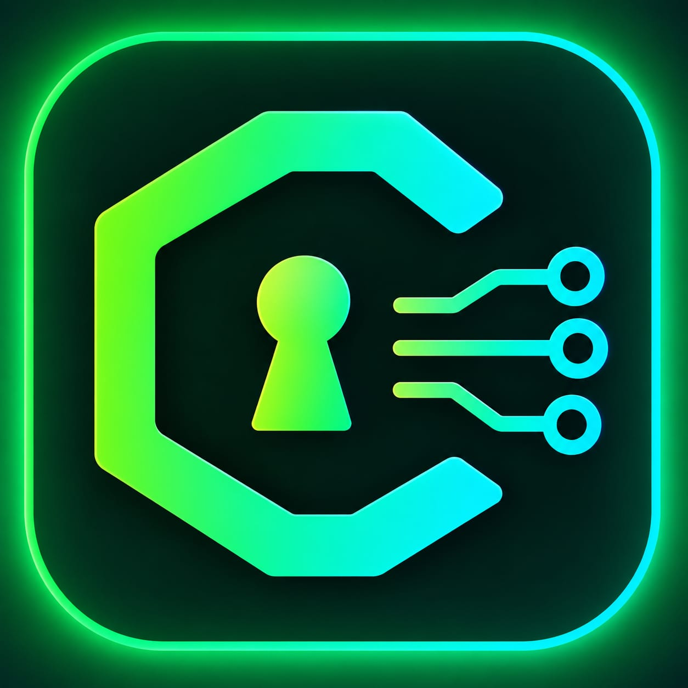

<div align="center">

  

  # 🔐 CryptoKit

  ### Secure. Encrypt. Build.

  A modern cryptography and cybersecurity platform designed to provide
  powerful security tools, educational resources, and practical solutions.

  <p>
    <a>
      🌐  Website under active development
    </a>
  </p>

  <p>
    
    
    
    
  </p>

</div>

---

## 📌 About CryptoKit

**CryptoKit** is a cybersecurity and cryptography-focused platform
developed to make security tools more accessible, practical, and easy to
understand.

Our platform brings together cryptographic utilities, file security tools,
and educational resources in one place.

The project focuses on combining modern web technologies with cybersecurity
concepts to create a reliable and user-friendly experience.

---

## 🌐 Official Website


> The website is currently under active development. New tools,
> improvements, and security features will be added in future updates.

---

## ✨ Key Features


### 🔐 1. Normal — Core Cryptography Tools

- 🔑 **RSA Key Generator**
  - Generate RSA key pairs with configurable key sizes.
  - Support for RSA-2048 and RSA-4096.
  - Export keys in PEM format.

- 🛡️ **File Integrity Checker**
  - Verify file integrity using cryptographic hashing.
  - Detect unexpected file modifications.
  - Generate and compare file hashes.
  - Support for SHA-256 and SHA-512.

- #️⃣ **Hash Generator**
  - Generate cryptographic hashes using multiple algorithms.
  - Support for MD5, SHA-1, and BLAKE2.

- 🔒 **Text Encrypt / Decrypt**
  - Encrypt and decrypt messages using AES-256 or RSA.
  - Explore different encryption modes and cryptographic concepts.

- ✍️ **Digital Signature**
  - Sign and verify documents digitally.
  - Support for RSA-PSS and ECDSA.

- 🔐 **Password Tools**
  - Generate secure passwords.
  - Analyze password strength and entropy.
  - Use cryptographically secure random generation.

- 🖥️ **Developer-Friendly Interface**
  - Clean and modern user interface.
  - Easy-to-use security tools.
  - Responsive website design.
  - Organized documentation and resources.

- 📚 **Educational Resources**
  - Learn fundamental cryptography concepts.
  - Explore cybersecurity fundamentals.
  - Access security tool documentation.
  - Practice with hands-on cryptographic tools.


### ⚡ 2. Pro — Advanced Security Arsenal

- 🛡️ **Crypto Security Scanner**
  - Deep-scan cryptographic implementations.
  - Identify weak ciphers and deprecated protocols.
  - Perform vulnerability and security checks.

- 🔑 **Advanced RSA Lab**
  - Inspect RSA keys and cryptographic parameters.
  - Analyze CRT optimizations.
  - Experiment with factorization attack simulations.
  - Explore Pollard's Rho and related RSA concepts.

- 📈 **Advanced ECC Suite**
  - Explore ECDH key exchange.
  - Inspect ECDSA signature components.
  - Visualize elliptic curves using curve plotting tools.
  - Experiment with advanced ECC concepts.

- 📂 **Batch File Integrity Checker**
  - Verify the integrity of multiple files simultaneously.
  - Perform parallel hashing and bulk comparison.
  - Generate detailed integrity reports.

- 📄 **Security Report Generator**
  - Generate comprehensive security audit reports.
  - Include vulnerability findings and risk scores.
  - Export security reports as PDF.
  - Maintain an audit trail.


### 🚀 3. Quantum — Advanced Security Labs

- 🎯 **Cryptographic Attack Simulator**
  - Simulate Padding Oracle attacks.
  - Experiment with Brute Force attacks.
  - Explore Length Extension attacks.
  - Test attacks against custom payloads in a controlled environment.

- 🚩 **Crypto CTF / Challenge Mode**
  - Solve interactive cryptography challenges.
  - Practice cryptographic problem-solving skills.
  - Work through isolated security challenges.
  - Develop practical cryptanalysis skills.

- 🔬 **Crypto Forensics Lab**
  - Investigate compromised cryptographic keys.
  - Analyze packet captures and PCAP files.
  - Explore cryptographic evidence in controlled forensic scenarios.
  - Practice security investigation techniques.

## 🛠️ Technologies Used

| Technology | Purpose |
|---|---|
| HTML5 | Webpage structure |
| CSS3 | Styling and responsive design |
| JavaScript | Interactive functionality |
| Node.js | Backend development |
| Git & GitHub | Version control |
| Vercel | Website deployment |
| Cryptographic Algorithms | Security functionality |

---

## 📂 Project Structure

```text
CryptoKit-offical/
│
├── frontend/
│   ├── components/
│   ├── pages/
│   ├── assets/
│   └── ...
│
├── backend/
│   ├── routes/
│   ├── controllers/
│   ├── services/
│   └── ...
│
├── images/
│   └── logo.png
│
├── README.md
├── .gitignore
└── package.json
```

> The actual folder structure may change as the project develops.

---

## 🚀 Getting Started

### 1. Clone the Repository

```bash
git clone https://github.com/CryptoKit-Team/OurCryptoKit-offical.git
```

### 2. Navigate to the Project

```bash
cd CryptoKit-offical
```

### 3. Install Dependencies

Navigate to the required frontend or backend directory and install
the necessary dependencies.

```bash
npm install
```

### 4. Run the Project

```bash
npm run dev
```

> Follow the instructions in the respective frontend and backend
> directories for running the complete application.

---

## 👥 Our Team

CryptoKit is developed by a team of four passionate students and
technology enthusiasts working together on cybersecurity and cryptography.

| Team Member | Role |
|---|---|
| Dev Choudhary | Frontend Developer & Assistant Algorithm Helper |
| Ashish | Algorithms & Security Tools Designer |
| Sadanand | Backend Developer |
| Narendra | Security & Database Developer |

> Team responsibilities may evolve as the project grows.

---

## 🔐 Security

Security is one of the core priorities of CryptoKit.

We aim to:

- Follow secure development practices.
- Protect sensitive information.
- Avoid exposing private keys and credentials.
- Improve the security of our tools continuously.
- Encourage responsible use of cryptographic technologies.

⚠️ **Important:** Do not upload passwords, private keys, API keys,
database credentials, or other sensitive information to this repository.

---

## 📖 Documentation

Documentation and learning resources will be added as the project
continues to develop.

Planned documentation includes:

- Cryptography fundamentals.
- Tool usage guides.
- API documentation.
- Security guidelines.
- Developer setup instructions.

---

## 🗺️ Future Plans

We are continuously working to improve CryptoKit.

### Planned Updates

- [ ] More cryptography tools.
- [ ] Improved RSA and ECC functionality.
- [ ] Advanced file security features.
- [ ] Backend API integration.
- [ ] Improved documentation.
- [ ] Security improvements.
- [ ] Better user experience.
- [ ] Additional developer resources.

---

## 🤝 Contributing

We welcome suggestions, improvements, and contributions that help make
CryptoKit better.

If you want to contribute:

1. Fork the repository.
2. Create a new branch.
3. Make your changes.
4. Commit your changes.
5. Open a Pull Request.

---

## 📄 License

This project will include an appropriate open-source license as the
project develops.

---

## 📬 Contact

For questions, suggestions, or collaboration:

📧 **Email:** cryptokit.team@gmail.com

🌐 **Website:** "Under Development"

💻 **GitHub:** https://github.com/CryptoKit-Team

---

<div align="center">

  ### 🔐 CryptoKit

  **Secure. Encrypt. Build.**

  Made with ❤️ by the CryptoKit Team.

</div>
